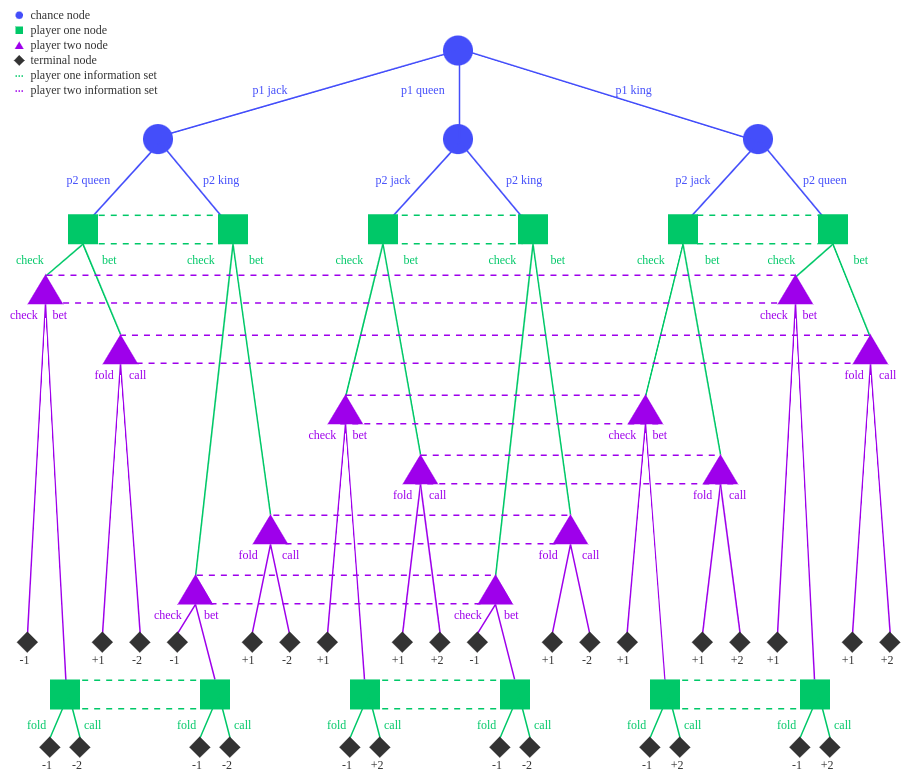

# Poker-Solver
This is an implementation of [Counterfactual Regret Minimization (CFR)](https://martin.zinkevich.org/publications/regretpoker.pdf) for a simplified version of Texas Hold'em poker ([Kuhn Poker](https://en.wikipedia.org/wiki/Kuhn_poker)). CFR is an algorithm that is commonly used to solve imperfect information games. It is guaranteed to converge to a Nash equilibrium in finite two-player zero-sum games, such as many two-player poker variants. A Nash equilibrium is a set of strategies in which neither player can improve their expected payoff by changing their own strategy, as long as the other player doesn't change theirs. An interesting consequence of this is that the poker agent can learn to bluff and react to the opponent's bluffs (although it is of course impossible to predict with certainty whether an opponent is bluffing).
Heads up Limit Hold'em Poker Solver using CFR Algorithm

## How to run the code
``` 
$ Python main.py
```

Edit the _constant.py_ to change the game parameteres.

## Rules

1. Three cards (King(K), Queen(Q) and Jack(J)) are dealt among two players (Valuation: K > Q > J)
2. Each player antes 1 chip to begin the game (an ante is a forced bet at the start of every hand)
3. Each player can check, bet 1 chip, call and fold.
4. If **player 1 valuation** > **player 2 valuation**,
    1. If both player check, player 1 **wins 1** chip
    2. If player 1 check and player 2 bet,
        1. Player 1 **loses 1** chip if player 1 folds
        2. Player 1 **wins 2** chip if player 1 calls
    3. If player 1 bets,
        1. Player 1 **wins 1** if player 2 folds.
        2. Player 1 **wins 2** if player 2 calls
5. If **player 2 valuation** > **player 1 valuation**,
    1. If both player check, player 1 **loses 1** chip
    2. If player 1 check and player 2 bet,
        1. Player 1 **loses 1** chip if player 1 folds
        2. Player 1 **loses 2** chip if player 1 calls
    3. If player 1 bets,
        1. Player 1 **wins 1** if player 2 folds.
        2. Player 1 **loses 2** if player 2 calls


<figcaption>Game Tree of heads-up limit hold’em Poker (Kuhn Poker)</figcaption>

## Evaluation
Strategies Calculated in 10000 Iterations:
```
Player 1 strategies: 
J rr   [0.79,0.21]
J rrpb [1.00,0.00]
Q rr   [1.00,0.00]
Q rrpb [0.45,0.55]
K rr   [0.39,0.61]
K rrpb [0.00,1.00]

Player 2 strategies: 
Q rrp  [1.00,0.00]
Q rrb  [0.66,0.34]
K rrp  [0.00,1.00]
K rrb  [0.00,1.00]
J rrp  [0.67,0.33]
J rrb  [1.00,0.00]

Player 1 EV:  -0.05666979368427769
Player 2 EV:  0.05666979368427769
```
## References:
1. https://aipokertutorial.com/the-cfr-algorithm/
2. https://justinsermeno.com/posts/cfr/
